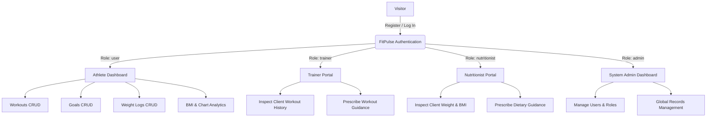
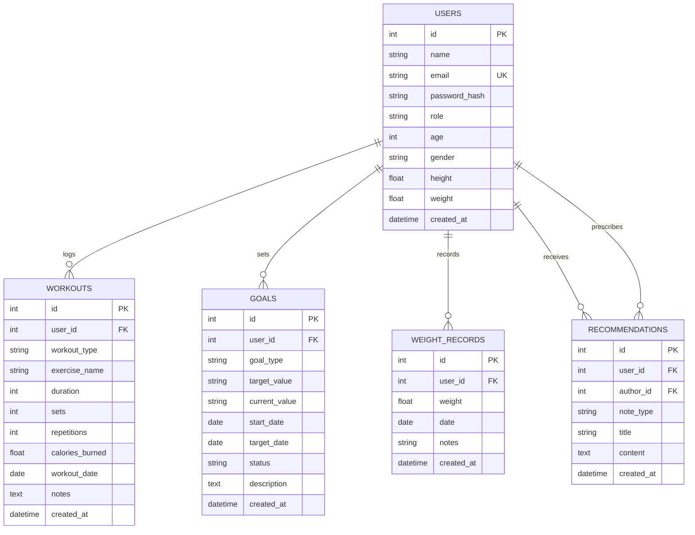

# FitPulse — Fitness & Workout Tracker Web Application

FitPulse is a production-grade full-stack web application developed using **Python, Flask, SQLite, SQLAlchemy ORM, Bootstrap 5, and Chart.js**. The platform enables fitness enthusiasts to record exercise routines, manage body weight logs, track fitness goals, calculate dynamic BMI metrics, visualize performance trajectories via interactive charts, and collaborate directly with certified trainers and clinical nutritionists.

---

## 1. System Objectives & Highlights

- **Full-Stack Architecture**: Complete implementation of frontend views, backend MVC routing, relational SQLite database with SQLAlchemy ORM, and JSON APIs.
- **Role-Based Access Control (RBAC)**: Secure multi-role access control for **Users (Athletes)**, **Trainers**, **Nutritionists**, and **Administrators**.
- **Interactive Visualizations**: Real-time interactive charts built with **Chart.js** displaying weight trajectories, workout frequency/duration, calorie expenditure, and goal completion status.
- **Dynamic BMI Analytics**: Live WHO-standard BMI calculator with interactive range sliders, gauge meters, and historical BMI timelines.
- **Professional Collaboration**: Specialized portals allowing Trainers to prescribe workout routines and Nutritionists to provide dietary guidance.
- **Zero-Trust Security**: Industrial-standard Werkzeug password hashing, session management, CSRF protection principles, and strict record authorization.

---

## 2. Technology Stack

| Layer | Technologies Used |
|---|---|
| **Backend Framework** | Python 3.14+, Flask 3.1.x |
| **Database & ORM** | SQLite 3, SQLAlchemy 2.0+ (Flask-SQLAlchemy 3.1.x) |
| **Security & Auth** | Werkzeug Security (`generate_password_hash`, `check_password_hash`), Flask Sessions |
| **Frontend Layout** | HTML5, Vanilla CSS3 (Custom Dark-Slate Theme), JavaScript (ES6+) |
| **UI Components & Icons** | Bootstrap 5.3.2, Bootstrap Icons 1.11.3 |
| **Data Visualization** | Chart.js 4.4.2 (Line, Bar, Doughnut, and Pie charts) |
| **Testing Suite** | Pytest 9.1.x (20 automated unit & integration tests) |

---

## 3. System Actors & Role-Based Access Control (RBAC)

The application implements granular role-based authorization using custom Python decorators (`@login_required` and `@role_required(*roles)`):



### 1. User (Athlete)
- Register account, manage profile (Name, Age, Gender, Height, Current Weight).
- Log workouts with workout type, exercise name, duration, sets, reps, and calories burned.
- Filter, search, edit, and delete personal workout records.
- Set fitness goals with target values and deadlines, mark completed.
- Record weight history; automatically compute BMI and weight change trends.
- View interactive analytics charts and read specialist notes.

### 2. Trainer
- Access Trainer Dashboard with total client counts and workouts overview.
- Browse client directory and inspect specific client workout logs and fitness goals.
- Prescribe tailored workout routines and training guidance notes.

### 3. Nutritionist
- Access Nutritionist Dashboard with client BMI distribution metrics.
- Browse client roster and analyze historical weight logs and BMI trends.
- Prescribe dietary strategies, calorie targets, and hydration recommendations.

### 4. Administrator
- Access Admin Dashboard with system-wide statistics (users by role, total workouts, goals, weight logs).
- User Management: Create accounts with any role, edit user details/roles, or delete accounts.
- Global Management: Audit and delete any workout, goal, or weight log across the entire platform.

---

## 4. Database Architecture & ER Design

SQLite relational database managed through SQLAlchemy ORM models with cascading relationships:



---

## 5. Project Directory Structure

```
software_project/
├── app.py                      # Flask Application Factory, Error Handlers & CLI
├── config.py                   # Development, Testing, and Production Config
├── seed.py                     # Realistic Database Seeding Script
├── requirements.txt            # Python Dependencies
├── .gitignore                  # Git Ignore Rules
├── README.md                   # System Documentation & Architecture Guide
│
├── instance/
│   └── fitness.db              # SQLite Database File
│
├── models/
│   ├── __init__.py             # SQLAlchemy instance and model exports
│   ├── user.py                 # User model (password hashing & BMI helpers)
│   ├── workout.py              # Workout model (icons & serialization)
│   ├── goal.py                 # Goal model (status & expiration helpers)
│   ├── weight.py               # WeightRecord model (BMI calculation)
│   └── recommendation.py       # Trainer & Nutritionist advice model
│
├── routes/
│   ├── __init__.py             # RBAC Decorators (@login_required, @role_required)
│   ├── auth.py                 # Authentication routes (register, login, logout)
│   ├── dashboard.py            # Landing page & User Dashboard
│   ├── profile.py              # Profile management & weight auto-sync
│   ├── workout.py              # Workouts CRUD & filterable history
│   ├── goal.py                 # Goals CRUD & status toggle
│   ├── weight.py               # Weight logs CRUD & trend calculations
│   ├── bmi.py                  # BMI calculator & JSON calculation API
│   ├── progress.py             # Progress analytics & Chart.js data API
│   ├── trainer.py              # Trainer portal & workout advice
│   ├── nutritionist.py         # Nutritionist portal & dietary advice
│   └── admin.py                # Admin portal & global user/data management
│
├── static/
│   ├── css/
│   │   └── style.css           # Modern Dark-Slate & Emerald/Cyan Theme
│   └── js/
│       ├── main.js             # Form validation, modals, toast alerts
│       ├── bmi.js              # Real-time interactive BMI calculator & sliders
│       └── charts.js           # Chart.js initialization & dynamic time filtering
│
├── templates/
│   ├── base.html               # Master layout with responsive navbar & modals
│   ├── index.html              # Hero landing page
│   ├── login.html              # Modern login card with test credentials accordion
│   ├── register.html           # Full registration form with validation
│   ├── dashboard.html          # User dashboard with metric cards & recommendations
│   ├── profile.html            # Profile edit form
│   ├── bmi.html                # Interactive BMI calculator with WHO gauge
│   ├── progress.html           # Dynamic Chart.js analytics dashboard
│   ├── workouts/
│   │   ├── add.html            # Add workout form
│   │   ├── edit.html           # Edit workout form
│   │   └── history.html        # Filterable workout history table
│   ├── goals/
│   │   ├── add.html            # Add goal form
│   │   ├── edit.html           # Edit goal form
│   │   └── view.html           # Goal cards with status toggles
│   ├── weight/
│   │   ├── add.html            # Add weight log form
│   │   ├── edit.html           # Edit weight log form
│   │   └── history.html        # Weight history table with BMI badges
│   ├── trainer/
│   │   ├── dashboard.html      # Trainer dashboard & metrics
│   │   ├── users.html          # Client directory
│   │   └── user_detail.html    # Client details & prescribe workout guidance
│   ├── nutritionist/
│   │   ├── dashboard.html      # Nutritionist dashboard & BMI distribution
│   │   ├── users.html          # Client directory with BMI overview
│   │   └── user_detail.html    # Client details & prescribe dietary guidance
│   ├── admin/
│   │   ├── dashboard.html      # Admin dashboard with platform metrics
│   │   ├── users.html          # User management CRUD
│   │   ├── user_create.html    # Create user with specific role
│   │   ├── user_edit.html      # Edit user profile and role
│   │   ├── workouts.html       # Global workout management
│   │   ├── goals.html          # Global goals management
│   │   └── weights.html        # Global weights management
│   └── errors/
│       ├── 403.html            # Forbidden error page
│       ├── 404.html            # Not Found error page
│       └── 500.html            # Internal Server Error page
│
└── tests/
    ├── __init__.py
    ├── conftest.py             # Pytest fixtures & in-memory test database
    ├── test_auth.py            # Authentication & session tests (6 tests)
    ├── test_workouts.py        # Workout CRUD & isolation tests (4 tests)
    ├── test_goals.py           # Goal tracking & completion tests (3 tests)
    ├── test_weight_bmi.py      # Weight tracking & BMI calculations (3 tests)
    └── test_roles.py           # RBAC permission & portal tests (4 tests)
```

---

## 6. Installation & Execution Guide

### Prerequisites
- Python 3.10+ (Python 3.14 recommended)
- Virtual environment or standard pip package manager

### Step 1: Clone or Navigate to the Project Directory
```bash
cd c:/Users/work/Desktop/software_project
```

### Step 2: Create and Activate Virtual Environment (Optional but Recommended)
```bash
# Windows PowerShell / CMD
python -m venv .venv
.venv\Scripts\activate
```

### Step 3: Install Required Dependencies
```bash
pip install -r requirements.txt
```

### Step 4: Initialize and Seed Sample Data
Run the database seeder to populate realistic demo accounts, workouts, goals, weight logs, and specialist advice:
```bash
python seed.py
```

### Step 5: Start the Flask Development Server
```bash
python app.py
```
Open your browser and navigate to: **`http://127.0.0.1:5000`**

---

## 7. Sample Test Credentials

| Role | Email | Password | Dashboard Features Accessible |
|---|---|---|---|
| **User (Athlete)** | `user@fitness.com` | `User@123` | Personal Dashboard, Workouts, Goals, Weight, BMI, Progress Charts |
| **Trainer** | `trainer@fitness.com` | `Trainer@123` | Trainer Dashboard, Client Roster, Client Workout Logs, Prescribe Workout Guidance |
| **Nutritionist** | `nutritionist@fitness.com` | `Nutritionist@123` | Nutritionist Dashboard, Client BMI Analytics, Weight History, Prescribe Diet Guidance |
| **Administrator** | `admin@fitness.com` | `Admin@123` | Admin Dashboard, User CRUD, Role Management, Global Record Auditing |

*Additional sample users: `sarah@fitness.com` / `Sarah@123`, `david@fitness.com` / `David@123`.*

---

## 8. Automated Testing

The project includes an automated test suite with **20 unit and integration test cases** covering:
- Registration validations (email uniqueness, password matching, length)
- Login authentication, session creation, and logout
- Workout CRUD operations and multi-user isolation
- Goal creation, status transitions, and deletion
- Weight tracking, automatic current-weight synchronization, and BMI mathematical accuracy
- Role-based access control (RBAC) verification and authorization blocking

To execute the test suite:
```bash
python -m pytest -v
```

---

## 9. Software Engineering Diagram Mappings

| Diagram Type | Implementation Mapping |
|---|---|
| **Use Case Diagram** | Mapped directly to the 4 actors (`User`, `Trainer`, `Nutritionist`, `Admin`) with discrete blueprints in `routes/auth.py`, `routes/workout.py`, `routes/goal.py`, `routes/weight.py`, `routes/trainer.py`, `routes/nutritionist.py`, `routes/admin.py`. |
| **Class Diagram** | Implemented as SQLAlchemy ORM classes in `models/user.py`, `models/workout.py`, `models/goal.py`, `models/weight.py`, `models/recommendation.py` with foreign keys and cascade delete rules. |
| **Activity Diagrams** | Workflows for Registration (Validate $\to$ Hash $\to$ Create Initial Weight Record $\to$ Redirect), Login (Validate $\to$ Authenticate $\to$ Role Redirect), Workout logging, and Goal completion status toggling. |
| **Sequence Diagrams** | Request-Response cycle from Browser $\to$ Flask Blueprints $\to$ SQLAlchemy ORM $\to$ SQLite Database $\to$ Jinja2 Rendering / JSON API. |
| **Statechart Diagram** | Goal Status transitions: `ACTIVE` $\leftrightarrow$ `COMPLETED` and `EXPIRED` state evaluated dynamically based on `target_date`. |
| **Component Diagram** | Clean separation of concerns: Presentation Layer (HTML/CSS/JS/Chart.js), Controller Layer (Flask Blueprints), Domain Layer (SQLAlchemy Models), and Persistence Layer (SQLite). |
| **Deployment Diagram** | Local / Web server architecture running Flask WSGI application connected to SQLite relational instance. |
